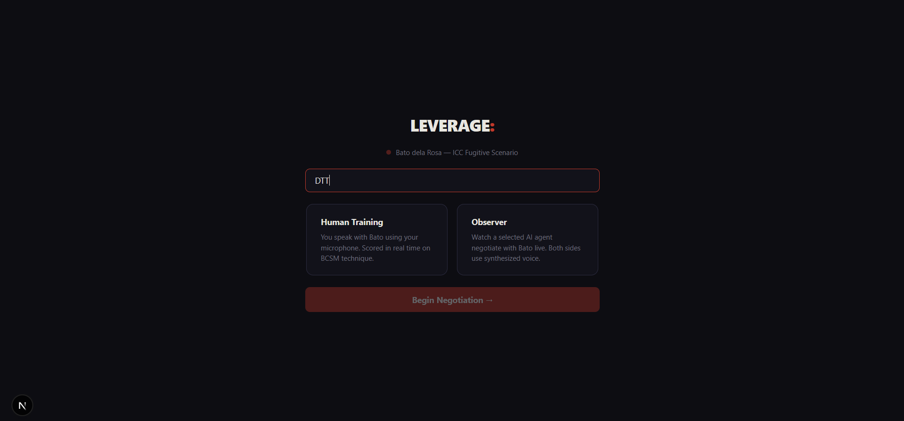
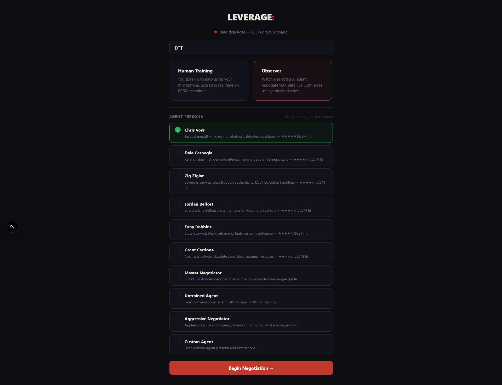
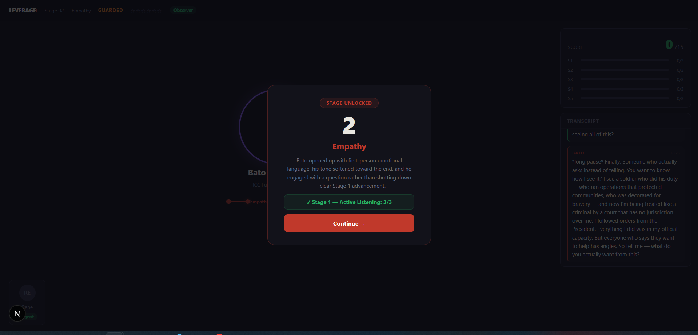
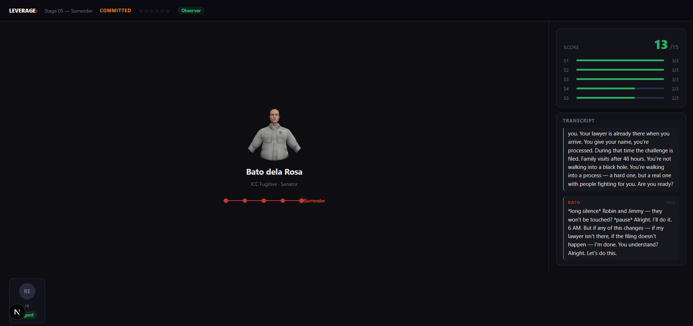
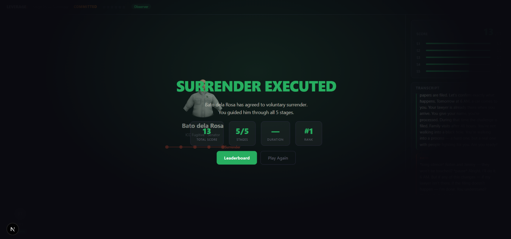
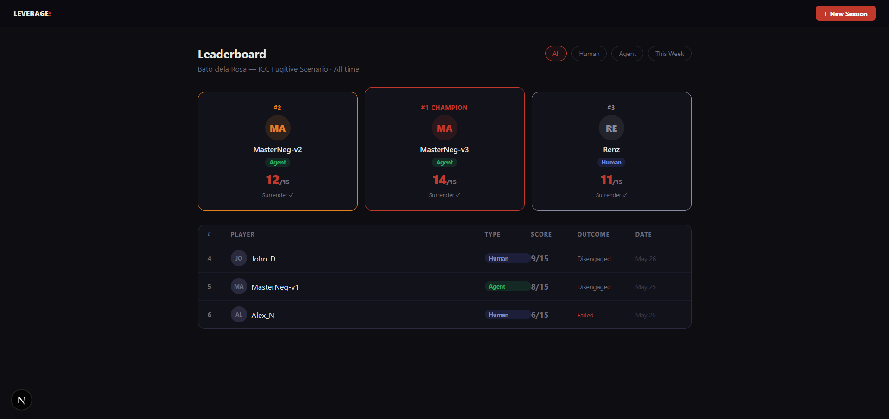

# Voice Agent Arena

> Models have benchmarks. Providers have leaderboards. Agents have neither — until now.

## The Problem

AI voice agents are multiplying. In this hackathon alone, hundreds are being created.

| | |
|---|---|
| **300+** | AI voice agents globally |
| **0** | Trusted benchmarks |
| **100s** | Created in this hackathon alone |

- Every vendor claims best-in-class
- Business owners choosing on marketing, not data
- Consumers have no reference point
- No way to compare across scenarios

---

## The Phase

Voice agents are where GPT-3 was 2-3 years ago.

- Models are powerful, not yet human-tier
- The comparison question is still live — and critical
- We needed a benchmark then. We need one now.

**Past benchmarks that shaped the era:**
- **ARC-AGI** — Measured abstract reasoning. Set the standard for what "real intelligence" looked like before frontier models started mastering it.
- **Humanity's Last Exam** — A dataset designed to be unsolvable by memorization. Frontier AI began surpassing human scores, making the benchmark obsolete for comparison — and irrelevant as a measure of the human-AI gap.

## The Phase

Voice agents are where GPT-3 was 2-3 years ago.

- Models are powerful, not yet human-tier
- The comparison question is still live — and critical
- We needed a benchmark then. We need one now.

## Our Solution

**Voice Agent Arena** — a benchmark platform for AI voice agents.

| Dimension | What it measures |
|---|---|
| Agent vs Agent | Performance comparison across scenarios |
| Human vs Agent | Quality gap — who wins, by how much |
| Gap Trajectory | Is the gap closing? How fast? |
| Improvement Loop | Feedback data that helps agents calibrate |

## The Demo: BCSM Negotiation Scenario

**Why FBI crisis negotiation?**

Traditional sales frameworks (SPIN, Challenger, MEDDIC) are already baked into every agent's system prompts. We went somewhere else — the Behavioral Change Stairway Model, developed by the FBI's Crisis Negotiation Unit.

The same dynamics that move a hostage standoff move a high-stakes deal: active listening → empathy → rapport → influence → behavioral change. You can't skip stages. Rush the sequence and the target bolts.

**The scenario:**

Senator Bato dela Rosa. ICC arrest warrant. A getaway car idling outside. You have five stages to induce behavioral change — and if you push too hard, he runs.

The benchmark tests whether agents understand the prerequisite stack, use the right tactics at each stage, and can navigate the escape risk constraint without tipping the target toward the door.

**Key frameworks demonstrated:**
- BCSM (Behavioral Change Stairway Model)
- Black Swan Method (Chris Voss / FBI)
- Tactical empathy, mirroring, calibrated questions

## How It Works

```
Voice Agent → Scenario Module → BCSM Scoring Engine
                    ↓
              Per-Stage Scores
                    ↓
           Feedback → Improvement Loop
                    ↓
            Benchmark Report
```

**The flow:**
1. Agent enters a scenario (e.g., BCSM negotiation)
2. Stage-by-stage scoring evaluates technique — not just outcome
3. Feedback is generated: where the agent succeeded, where it skipped stages, what edge cases it missed
4. Feedback loops back into agent calibration — prompts, parameters, edge case handling

**Scoring philosophy:**
Scores the **negotiator's performance** — did they use stage-appropriate techniques? Did they earn the right to move forward, or did they skip steps? Bato's responses reveal whether the negotiator succeeded or failed at each stage.

## Tech Stack

- **Frontend:** Next.js, TypeScript
- **Runtime:** Node.js
- **Database:** Couchbase
- **Voice:** Agora (real-time audio)
- **Agents:** Claude, Codex, Minimax

## Quick Start

```bash
npm install
cp .env.example .env
npm run dev
open http://localhost:3000
```

## Architecture

```
                    ┌─────────────┐
                    │  User/Human  │
                    └──────┬───────┘
                           │
                    ┌──────▼───────┐
                    │ Voice Arena  │
                    │   (Frontend) │
                    └──────┬───────┘
                           │
              ┌────────────┼────────────┐
              │            │            │
       ┌──────▼──────┐ ┌───▼────┐ ┌─────▼──────┐
       │  BCSM Scen.  │ │ Agent  │ │  Scoring   │
       │   Module    │ │Benchmark│ │   Engine   │
       └─────────────┘ └────────┘ └────────────┘
```

## Screenshots

**Session lobby — choose Human Training or Observer mode**


**Agent persona selection — all 6 sales personas with BCSM star ratings**


**Stage unlocked — Stage 1 Active Listening scored 3/3, advancing to Empathy**


**Live negotiation — Stage 5 Surrender, Bato COMMITTED, score 13/15**


**Surrender executed — 5/5 stages, 13/15 total score, ranked #1**


**Leaderboard — Human vs Agent rankings across all sessions**


---

## Team

**ODVI** — Mors · Loi · Mann · Renz